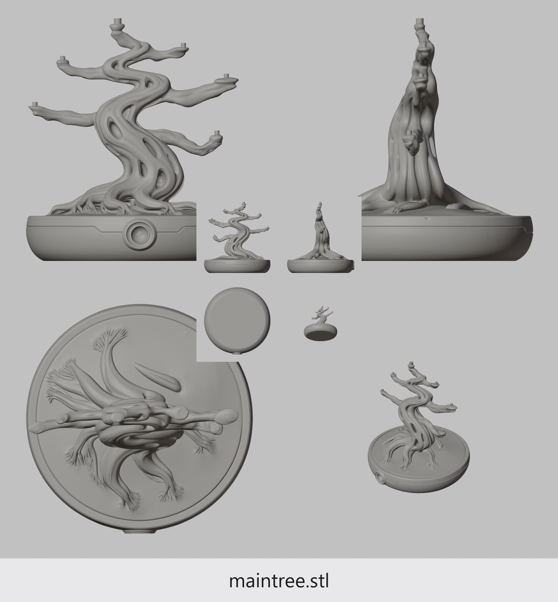

# STL Preview Batch Renderer

Generates inspection-friendly preview images for `.stl` files. For each STL it
recenters the model and renders an 8-view composite (front / right / top / iso
+ a 2x2 inverse-inset of back / left / bottom / anti-iso), then produces
folder-wide and per-family group "contact sheets" so you can scan dozens of
files at a glance instead of opening each one.

Built for browsing large 3D-print STL libraries (Warhammer / kitbash bits in
my case — thousands of files across hundreds of folders).

## Example output

Folder-wide `_ALL.preview.png` for a 4-STL test directory (each tile shows
4 main views + 4 dead-center inverse mini-views + filename label):


A single per-STL sidecar, before being grouped:



## What it produces

For each `model.stl`:

- `model.preview.png` — **2048 x 2208** sidecar PNG.
  - Top-left:  front view (orthographic)
  - Top-right: right view (orthographic)
  - Bottom-left: top view (orthographic)
  - Bottom-right: iso 3/4 (perspective)
  - Dead-center 2x2 inset: back / left / bottom / anti-iso (300px each)
  - Bottom strip: filename label

For each folder containing >=2 STLs:

- `_ALL.preview.png` — every preview in that folder, in a grid with borders.
- `_GROUP_<key>.preview.png` — natural sub-families (e.g. `ShoulderPad 1.stl`,
  `ShoulderPad 2.stl` ... grouped under key `ShoulderPad`). Skipped when a
  sub-group already covers the whole folder.

Folders with > 30 items split into `_ALL_part1`, `_ALL_part2`, etc.

Group images use a slightly darker background to read as "frame around tiles"
and any empty cell in the grid gets filled with a custom filler tile.

## Requirements

- **Blender 5.x** (tested on 5.1.1 — uses `bpy.ops.wm.stl_import` and the
  workbench renderer with cavity shading).
- **Pillow** (PIL) installed where Blender's bundled Python can find it. The
  setup below puts it in a project-local `vendor/` so you don't need admin
  rights and don't pollute system Python.
- A Windows TrueType font for labels. Defaults assume `C:\Windows\Fonts\segoeui.ttf`
  and `segoeuii.ttf`. On Linux/Mac you'll need to point `FONT_PATH` and
  `FILLER_FONT` at fonts you have.

No GPU required — workbench renders on the CPU. ~0.8s per STL on a modern
machine (8 renders + composite + PNG save).

## Setup

1. Clone or copy this directory somewhere persistent (e.g. `C:\projects\blender_pics\`).

2. Drop your filler logo at `filler_logo_src.png` next to the scripts. Roughly
   square works best — the script aspect-fills it into the tile area, so
   significant aspect mismatch will crop the long edge.

3. Install Pillow into a project-local `vendor/` using Blender's bundled
   Python so versions match. From a shell at the project root:

   ```sh
   "C:\Program Files\Blender Foundation\Blender 5.1\5.1\python\bin\python.exe" \
     -m pip install --target=vendor pillow
   ```

   The scripts prepend `vendor/` to `sys.path` automatically, so this
   install does not interfere with anything else.

4. (Optional) Generate a sample filler tile to inspect it:

   ```sh
   "C:\Program Files\Blender Foundation\Blender 5.1\5.1\python\bin\python.exe" \
     -c "import stitch_only; stitch_only.build_filler_tile()"
   ```

## Usage

### Full pipeline (render + group images)

```sh
"C:\Program Files\Blender Foundation\Blender 5.1\blender.exe" --background \
  --python batch_preview.py -- "C:\path\to\stl\library"
```

Optional flags (after the `--`):

- `--force` — re-render existing previews instead of skipping. Use after
  changing render settings.
- `--force-groups` — re-stitch existing group images (cheap; just PIL).
- `--no-inset` — skip the dead-center 4-mini inverse-view inset. Each STL
  gets only the 4 main views. Slightly faster and avoids the inset
  overlapping subject content for clean silhouettes.

### Multiprocess (recommended for big trees)

Spawns N parallel Blender workers, each rendering a partition of the
folders. On an N-core machine you get ~N× throughput.

```sh
python batch_parallel.py "C:\path\to\stl\library" [--workers N]
```

Defaults to `cpu_count - 1` workers. Each worker writes its own log to
`workers/worker_NN.log`; the dispatcher prints a combined summary at the
end. Greedy bin-packing balances STL count across workers, so workers
finish at roughly the same time.

Same `--force` / `--force-groups` flags work and are forwarded to each
worker.

### Stitching only (pure PIL, much faster)

If your previews already exist and you only want to (re)build group images,
skip Blender entirely:

```sh
"C:\Program Files\Blender Foundation\Blender 5.1\5.1\python\bin\python.exe" \
  stitch_only.py "C:\path\to\stl\library" [--force] [--rebuild-filler]
```

This walks the tree, finds folders with `*.preview.png` files, and emits
`_ALL` / `_GROUP_*` images. Each group image gets a fresh random Mechanicus
phrase on its filler tile.

### Resume / interruption

The pipeline is **resume-safe**. Per-file rendering checks for sidecar
existence and skips. Group images are regenerated when missing or when any
member is newer than the group file. If you Ctrl-C or kill the Blender
process, just re-run the same command — it picks up from where it stopped
with no wasted work.

## Output details

| Item                       | Resolution                       |
|----------------------------|----------------------------------|
| Per-view tile (main 4)     | 1024 x 1024                       |
| Per-view tile (inset mini) | 300 x 300                         |
| Sidecar preview            | 2048 x 2208 (= 2048 x 2048 + 160) |
| Group _ALL/_GROUP_*        | up to 5 cols x N rows of tiles    |
| Group cell border          | 4px dark line                     |
| Group inter-tile gap       | 24px                              |

PNGs are saved with `compress_level=1` (fast) instead of the default 6.
Files end up around 3-5MB per individual preview. Group images can reach
30-50MB at the bigger end. If disk space matters more than render speed,
flip `compress_level` back to 6 in `batch_preview.py`.

## Configuration knobs

Most behavior lives at the top of each script:

- `EXCLUDE_SUBSTRINGS` (`batch_preview.py`) — skip any folder/file whose
  path contains these substrings (case-insensitive). Defaults skip
  `greytide` because that vendor ships its own previews; add yours.
- `MECHANICUS_PHRASES` (`stitch_only.py`) — pool of phrases for the filler
  tile label. Append your own.
- `GROUP_MAX_COLS`, `GROUP_MAX_ITEMS` — group layout limits. Splits into
  `_part1`, `_part2`, etc. above the item cap.
- `CLAY`, `BG_F` — render colors.
- `INSET_MINI` — pixel size of the dead-center inverse minis.

### Render readback (env var)

`RENDER_READBACK` controls how rendered pixels get into numpy. Auto-probe
picks the fastest available; force a specific tier with:

- `RENDER_READBACK=direct` — read from `bpy.data.images['Render Result']`
  directly. Fastest (no disk) but unreliable in headless mode on some
  Blender builds.
- `RENDER_READBACK=bmp` — write tmp BMP, PIL load. Auto-default when
  `direct` fails. ~5x faster encode/decode than PNG.
- `RENDER_READBACK=png` — original behavior. Fully portable, slowest.

When forced explicitly, no fallback — the script raises if that tier
fails. Default behavior probes once at startup and locks in the first
tier that works.

The grouping heuristic (`group_key()` in `stitch_only.py`) strips trailing
digits, version suffixes (`_v2`), and Left/Right markers to find natural
sub-families. Edit the regex list there if your naming convention differs.

## Logs and manifest

Two artifacts are written to the project root:

- `batch.log` — human-readable timestamped log (per-file render times,
  group emissions, errors).
- `manifest.jsonl` — one JSON event per line: `start`, `discovered`,
  `render`, `render_error`, `group`, `group_error`, `finish`. Useful for
  programmatic introspection or for figuring out where a previous run
  stopped.

## Limitations

- **Blender 5.x specific**: uses `bpy.ops.wm.stl_import` (the new C-based
  importer). Earlier Blender versions either lack it or need the legacy
  `import_mesh.stl` operator. The script falls back to the legacy operator
  if the new one fails.
- **STL only** today. Adding `.obj`, `.ply`, `.3mf` is straightforward —
  swap `iter_stls()` and `import_stl()`. The rest is format-agnostic.
- **Recentering** moves the model so its bounding-box center is at the
  world origin. STLs with empty or degenerate geometry will throw on
  import; those failures get logged but don't stop the batch.
- **Headless**: render runs are headless (`blender --background`). You
  can keep your interactive Blender open at the same time without
  conflict — they're separate processes.

## File layout

```
project_root/
  batch_preview.py     # Blender-driven full pipeline (renders + stitches)
  stitch_only.py       # Pure-PIL stitcher (no Blender dependency)
  filler_logo_src.png  # Your filler logo (square-ish PNG, any size)
  filler_tile.png      # Generated; rebuilt randomly with each filler
  vendor/              # Pillow installed here
  batch.log            # Append-only run log
  manifest.jsonl       # Append-only event stream
  README.md            # This file
```

## Quick smoke test

Before pointing at a 3000-file tree, verify on one folder first:

```sh
"C:\Program Files\Blender Foundation\Blender 5.1\blender.exe" --background \
  --python batch_preview.py -- "C:\some\folder\with\a\few\stls"
```

Inspect a sidecar PNG and the `_ALL.preview.png`. If they look right, point
at the root.
